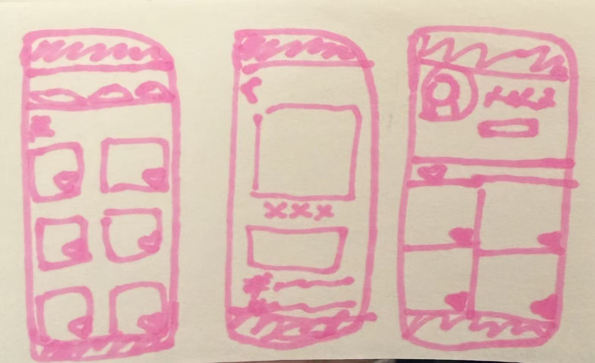
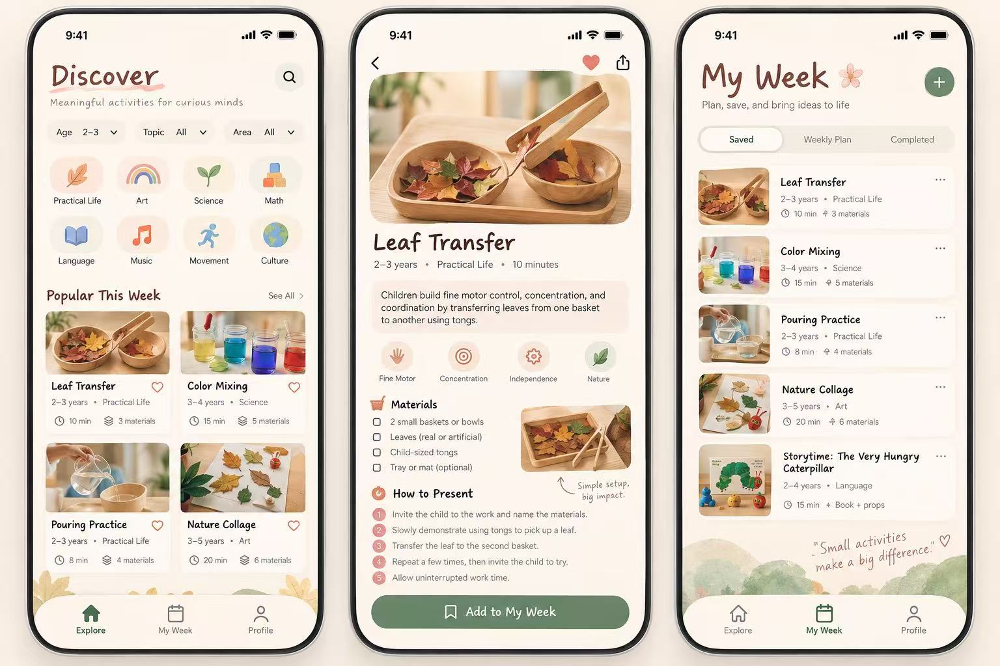

## Client Brief

**Client:** Yoyo and Reki, they are teachers working in Peninsula Montessori. Yoyo will be the main client since she will be directly using the product, Reki will oversees it.
**Purpose:** The website is for quickly finding lessons plan the suits each child's interest.
**Audience:** Yoyo, or teachers in the same position as Yoyo, who is a pre-school teacher and don't have that much time to prepare lessons every day, but wish to have lessons that will benefit each kids.
**Key action:** Filter the lessons plan to find what they need

**Pages needed:**
Main searching page, click-in page for each lessons plan, account page with basic info and saves.

**Content status:** I have the ages and titles for each lessons, but I will need more lessons plans with pictures becasue pictures on the website will save so much time for users.

**Style preferences:** light color, clear and preferably bigger front, each lessons plan should mainly represents by picutres, and some lessons might need music or recording upload.

**Inspiration sites:** Twinkle, Procare-only for style and UI, not the function, they describe they love how simple it is.

## Layout Plan

A sketch of the layout, drawn by hand and photographed or made in Figma, committed to the repo.
The description of that layout you gave to AI as your starting prompt.

